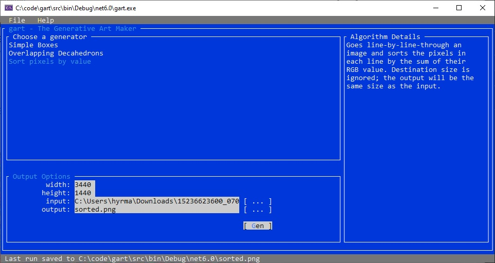

# gart

Welcome to `gart`; a C# application for creating generative art.

It is still very early in development so expect a lot of changes over the coming week.

I am building out a few generative art algorithms for fun and, since I promised to blog about them, I decided it was high time I find a way to procrastinate and do something else. `gart` is the culmination of that effort. But, more helpfully, it's the UI to run the various art generators.

The UI is built with 💖 using [Terminal.Gui](https://github.com/migueldeicaza/gui.cs). 

The only reason I'm even creating generative art is because of the amazing work that [James South](https://twitter.com/James_M_South) and [Six Labors](https://sixlabors.com/) have done to make working with graphics in .NET easy and painless.



## Generative art

If you've never heard the term, then Wikipedia has a [in-depth entry](https://en.wikipedia.org/wiki/Generative_art) on it. For my purposes, I am providing the computer with an overall structure but relying on it to introduce some randomness into the process. The tension and trade-off of "human-provided guidance" and "computer-generated randomness" will vary by implementation. It would be very easy to argue with some of the recipes that I have planned that the computer has no input into the process at all. So, in some cases, it might be better just to think of the work as 'computer-assisted art creation'. But, for my purposes, I'm going to keep everything under the same umbrella.

## Building the application

`gart` is a C# .NET 6.0 console application. From the root of the repository (where `gart.sln` lives; along with this readme), you can run `dotnet build -c Release` to build the application. By default, the resulting executable will be buried under `.\src\bin\Release\net6.0`. That's likely not useful so the next step is to publish the project. 

The following command will publish `gart` to `.\dist`. The path assumes, again, that you will run this from the repository root

```powershell
dotnet publish .\src\gart.csproj -o ./dist --no-self-contained
```

Alternately, you can execute `.\build.ps1` or `.\build.sh` to restore any missing Nuget packages, build the application and then publish the application to `.\dist`

## Contributing

It's a bit early for contributions for others. But, I would highly encourage you to fork `gart` and play around. Do your own thing. And, as always, you can message me on twitter [@hyrmn](https://twitter.com/hyrmn).

## The planned algorithms

- [Simple Colored Boxes](https://hyr.mn/lets-make-art-pt1)
- more to come